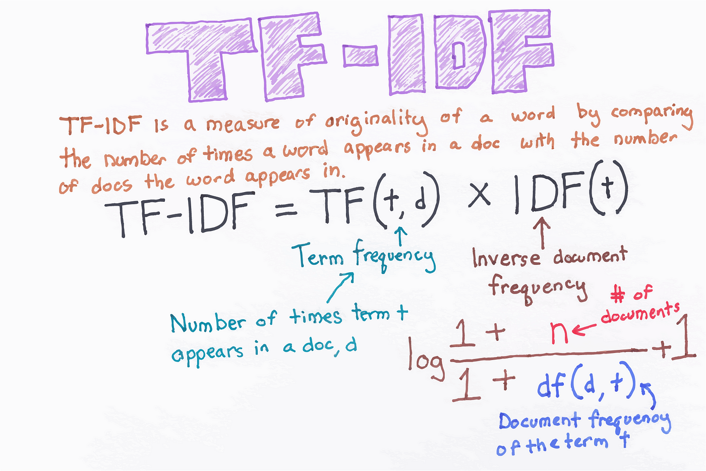
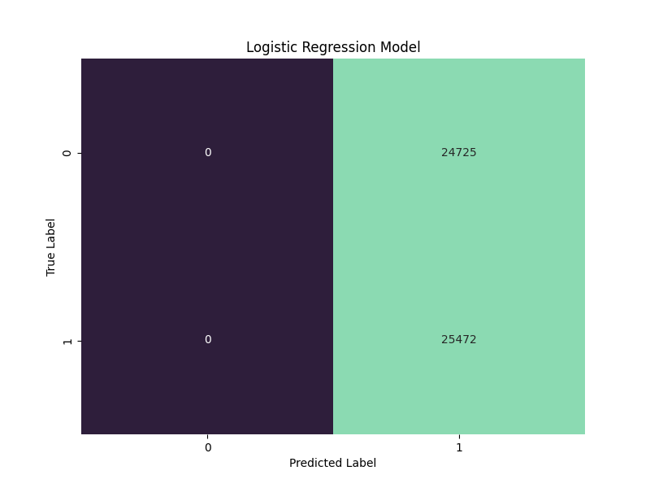
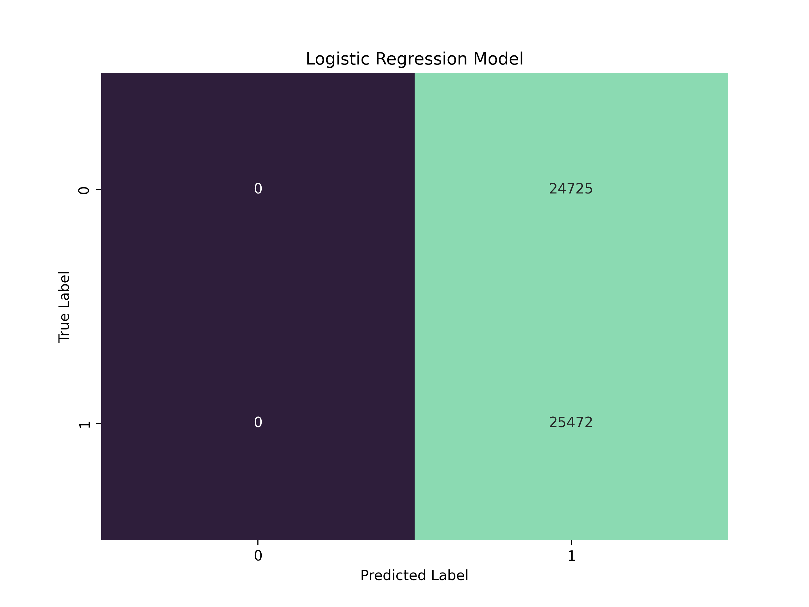

# Amazon Review Classifier Using PySpark

- **Project title:** Amazon Reviews Classifier Using Pyspark.
- **Dataset:** [Kaggle Amazon Reviews](https://www.kaggle.com/datasets/kritanjalijain/amazon-reviews?select=test.csv).
- **Technology:** `python` + `spark`.
- **Team:** CristÛbal Alc·zar, Yerko Garrido, Christopher Stears
- **Project Goal:** Create a term-frequency inverse document frequency (TF-IDF) feature matrix from the Amazon reviews dataset, and train a classification model to predict the product reviews.

## Abstract 

The increasing availability of large-scale datasets presents challenges in traditional machine learning approaches due to memory limitations and computational constraints. However, with Apache Spark's distributed computing capabilities, these challenges can be overcome. In this project, we aim to harness the power of PySpark, the Python library for Spark, to train a classifier on the [Kaggle Amazon Reviews](https://www.kaggle.com/datasets/kritanjalijain/amazon-reviews?select=test.csv) dataset, a massive collection of product reviews.

One of Spark's standout features is its ability to distribute computations across a cluster of machines, enabling the processing of datasets that exceed the memory capacity of a single machine. This distributed nature of Spark allows for parallel execution of tasks, making it an ideal platform for training machine learning models on extensive datasets. By utilizing PySpark's high-level API, MLlib, we can leverage its extensive set of distributed machine learning algorithms and tools.

Through this project, we aim to showcase the capabilities of PySpark and its MLlib library in tackling real-world machine learning challenges. By successfully training a sentiment classifier on the [Kaggle Amazon Reviews](https://www.kaggle.com/datasets/kritanjalijain/amazon-reviews?select=test.csv) dataset, we will demonstrate PySpark's ability to handle massive datasets, leverage distributed processing, and deliver scalable machine learning solutions. The insights gained from this project will not only advance our understanding of distributed machine learning but also open doors to scalable and efficient data analysis in various domains.


Here is an observation of the dataset:

> "2","Makes My Blood Run Red-White-And-Blue","I agree that every American should read this book -- and everybody else for that matter. I don't agree that it's scholarly. Rather, it's a joy to read -- easy to understand even for a person with two master's degrees! Between McElroy's chapter on How American Culture was Formed and Ken Burns' Lewis & Clark, I don't know which makes my blood run red-white-and-bluer. And as a child of the anti-establishment `60s, it's done a lot toward helping me understand why we Americans do what we do. It's the best history book I've ever read, the best history course I've ever taken or taught. I'm buying it for my home library for my grandchildren to use as a resource. We're also using it as a resource for a book on urban planning."

Each observation has three values: the polarity (1 for negative and 2 for positive), the heading and the body of the product review, respectively.


## Usage

For training the model, use the `train.py` script:

```bash
python3 train.py
```

Once the model is trained, you can load the pipeline with `inference.py` and 
get predictions. The output of this stage is saved in hdfs OUTPUT folder, and you can
check the file as follow:

```bash
hdfs dfs -cat /uhadoop2023/manco/amazon/predictions/part-00000-*.csv | head -n 10
hdfs dfs -cat /uhadoop2023/manco/amazon/predictions/part-00000-*.csv | wc
```

Then, you can copy the output from the hdfs to the local system:

```bash
hdfs dfs -get /uhadoop2023/manco/amazon/predictions/part-00000-*.csv part0.csv
```

## Data Preprocessing

The dataset is prepared by applying the following steps:

1. Combine the title and body columns into a single one.
2. Remove punctuation and any symbol different from letters and numbers.
3. Apply a tokenizer that separates the text by white spaces to build the vocabulary of the corpus.
4. Use the method CountVectorizer to count the number of each token per review.
5. Then, IDF performs the TF-IDF transformations based on the counts to compute the formula on the below image.
6. Finally, we get the feature matrix $N\times |V|$, in which $N$ is the number of observations, $|V|$ is the vocabulary size in the corpus, and each value in the matrix is the TF-IDF for a particular token in a product review.



## Models

TODO...

## Results

A super duper model classification report...

```
              precision    recall  f1-score   support

           1       0.00      0.00      0.00     24725
           2       0.51      1.00      0.67     25472

    accuracy                           0.51     50197
   macro avg       0.25      0.50      0.34     50197
weighted avg       0.26      0.51      0.34     50197
```

A nice confusion matrix plot...

<table border=0 align=center>
    <tbody>
        <tr>
     	    <td width="50%" align="center"> </td>
	    <td width="50%" align="center"> </td>
        </tr>
    </tbody>
</table>


## TODO

1. [X] Cargar los datos.
1. [X] Cambiar los nombres (?), los archivos no vienen con nombre creo
1. [X] Concatenar `review_body` y `review_title` en una sola columna
1. [X] Tokenizar, computar TF-IDF, luego entrenar una regresino logistica
1. [X] Guardar pipeline de prediccion
1. [X] Crear `inference.py` para utilizar el pipeline de predicciion
1. [ ] Escalar entrenamiento
1. [ ] Notebok para computar metricas y  analisis 
1. [X] Entrenar otra clase de modelo diferente tipo arboles
1. [ ] Agregar  secci√n breve en README con tipo de modelos entrenados
1. [ ] Agregar secci√n en README con resultados de los modelos
1. [X] Agregar parrafos sobre qu√ es Spark y su rol en el proyecto


## Reference

```
@misc{CC5212-massive-manco,
  authors = {Alc√°zar, Cristbal}, {Garrido, Yerko}, {Stears, Christopher}
  title = {Project group 8: Amazon Review Classifier Using Pyspark},
  year = {2023},
  publisher = {GitHub},
  journal = {GitHub repository},
  howpublished = {\url{https://github.com/alcazar90/CC5212-massive}},
}
```
